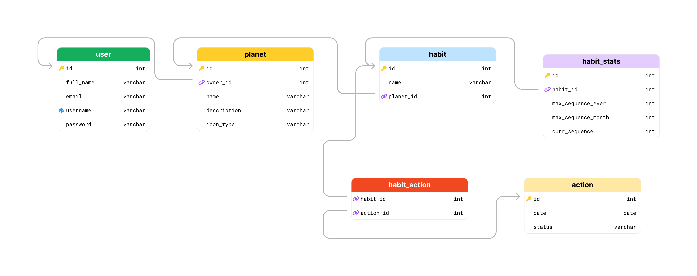
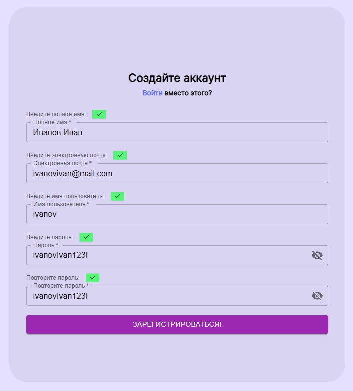
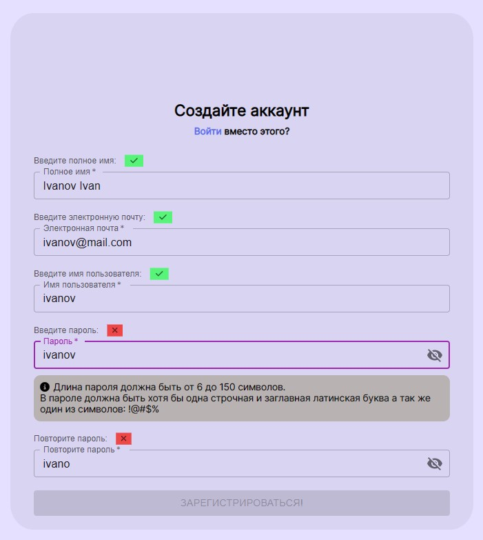
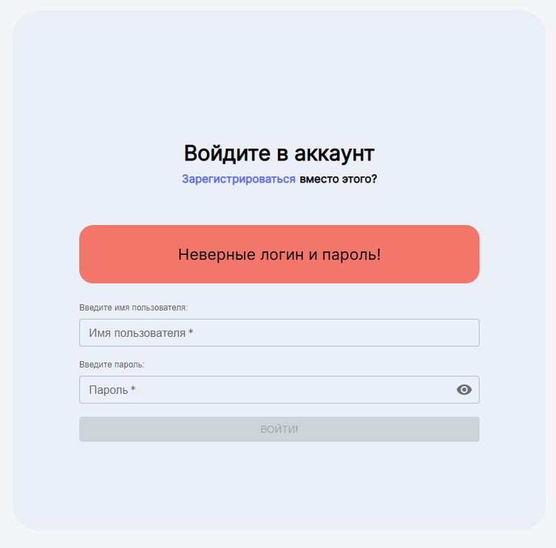
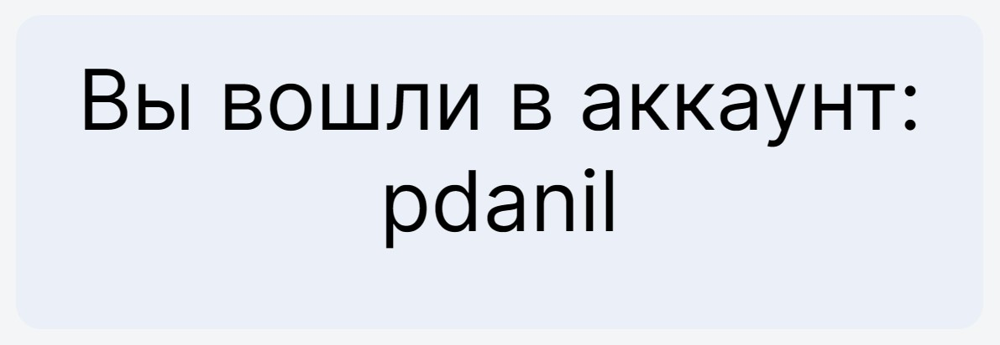

# Habit Planets - это трекер привычек

## В приложении реализовано 2 микросервиса (cервисы общаются между собой при помощи REST API):
+ Backend-микросервис, реализованный на Spring Framework, отвечает за регистрацию и аутентификацию пользователей, хранение их данных в БД (аутентификация реализована с помощью JWT-токенов)
+ Frontend-микросервис, реализованный на React JS, отвечает за отображение пользовательского интерфейса, валидацию данных, вводимых в формы регистрации и входа в аккаунт. Также во frontend-сервисе используется библиотека mui

## Backend-сервис принимает следующие запросы:
1. GET: /check-username/{username} - проверка наличия человека с заданным именем пользователя в БД
2. POST: /register - регистрация человека. Запрос принимает данные о пользователе в формате JSON, валидирует данные, шифрует пароль и сохраняет данные о человеке в базу данных
3. POST: /sign-in - вход в аккаунт. Запрос принимает имя пользователя и пароль в формате JSON, валидирует данные и возвращает JWT accessToken, после чего происходит переход на страницу пользователя
4. POST: /show-user-info - получение данных о пользователе. Запрос принимает JWT-токен, валидирует его и возвращает данные о пользователе (его username)

## Frontend-сервис принимает следующие запросы
1. GET: /sign-up - страница регистрации. При помощи react-хуков и mui-компонентов происходит динамическая валидация данных при их изменении. Кнопка регистрации становится активной только при успешной валидации всех полей
2. GET: /sign-in - страница входа в аккаунт. Данные также валидируются, при некорректных данных вход не происходит, пользователь видит ошибку. При успешном входе происходит переход на страницу пользователя
3. GET: /my-habits - страница пользователя. Если у пользоваля нет валидного JWT-токена, то происходит переход на страницу входа в аккаунт, если же пользователь уже входил, то отображается его информация

## Стек технологий:
### Backend:
1. Java
2. Spring Framework (Validation, Boot, Data, Security, REST)
3. Maven

### Frontend:
1. JavaScript
2. ReactJS (mui, hooks)
3. Axios
4. CSS

## Информация о базах данных:
В проекте использовалась следующая структура баз данных:

В таблице user хранятся данные пользователей, их пароли зашифрованы алгоритмом Bcrypt

## Интерфейс приложения:
1. При успешном вводе всех полей при регистрации:

2. При невалидных введенных данных

3. При неправильном логине и пароле при входе в аккаунт

4. При успешном входе в аккаунт
